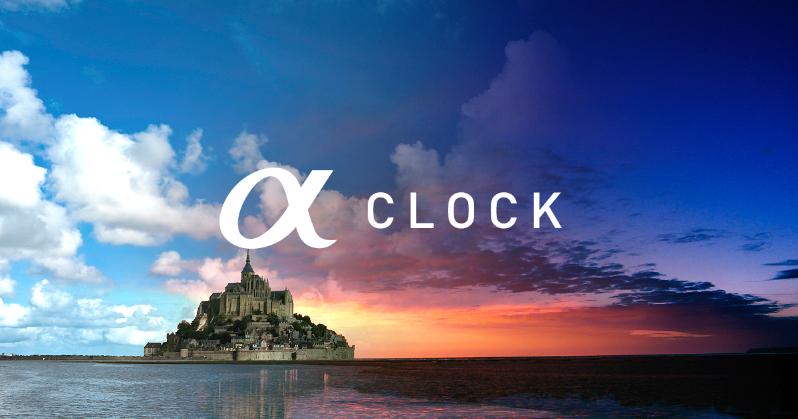
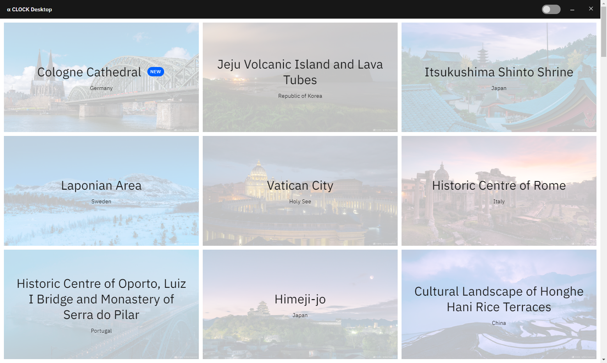
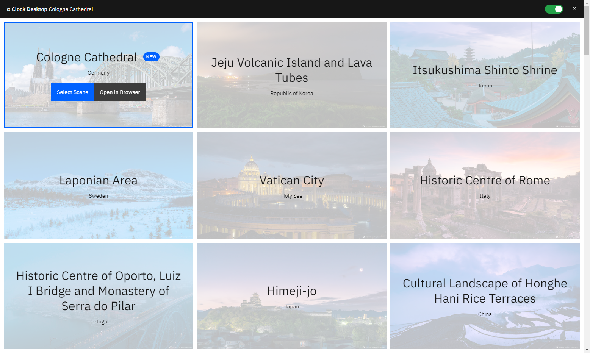

# α CLOCK Desktop



## About

This Electron application ports the “live” wallpapers of Sony's α CLOCK project and the main functionality of [its Android application](https://play.google.com/store/apps/details?id=com.sony.aclock) to your desktop computer using [the unofficial API](https://www.sony.net/united/clock/assets/js/heritage_data.js).

> Throughout the world, there are numerous "World Heritage" locations selected by UNESCO - treasures, both natural and manmade, that must be maintained for future generations to also enjoy. These locations include magnificent scenery formed naturally over innumerable decades, historical sites constructed in ancient eras, and other irreplaceable sources of life and inspiration. There are so many locations across the globe in the World Heritage List that it would be very difficult to visit all of them in a single lifetime. The α CLOCK project, brought to you by Sony, is an attempt to photograph these World Heritage locations with Sony's own α camera and to share these recorded treasures with the world.

## Installation

α CLOCK Desktop is still undergoing development, and there are no executables or builds yet. You can still run it using Electron though.

```
git clone https://github.com/TheLastZombie/Alpha-CLOCK-Desktop
cd Alpha-CLOCK-Desktop
npm install
npm start
```

## Usage

1. Start the application
2. Select a scene
3. Toggle the switch

Please note that α CLOCK Desktop does not run in the background yet, closing it will stop the wallpapers from automatically updating. You can, however, minimize it to the system tray.

## Screenshots




## Ideas

- Add download modes
  - Raw resources only (https://github.com/TheLastZombie/loaders/blob/master/Heritage%20Downloader.js)
  - macOS Dynamic wallpaper (https://itnext.io/macos-mojave-dynamic-wallpaper-fd26b0698223)
  - WinDynamicDesktop theme (https://github.com/t1m0thyj/WinDynamicDesktop/wiki/Creating-custom-themes)
  - GNOME timed wallpaper (https://github.com/michalmielczynski/gnome-live-wallpaper/blob/master/gnome-timed.xml)
